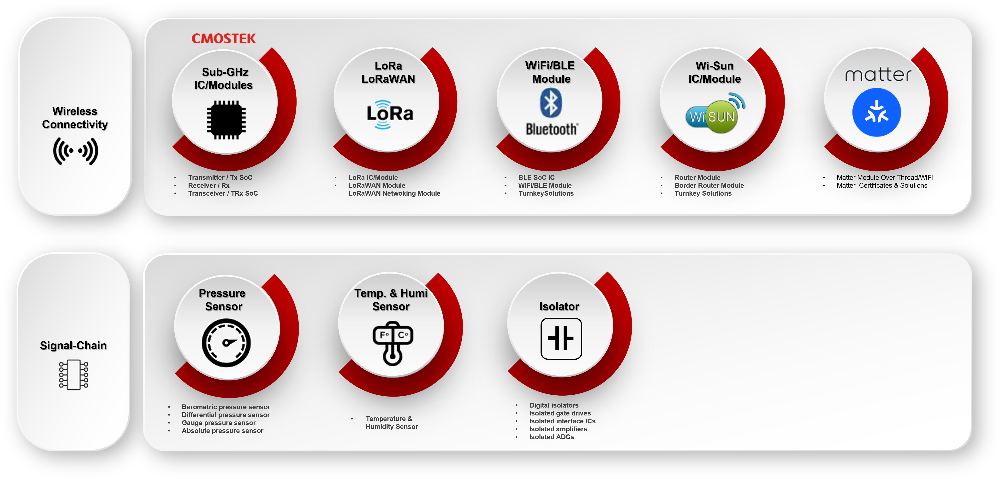

## Introduction
We would like to provide a quick introduction for customers who are new to HopeRF products, helping you set up your project quickly and move it into production.
HopeRF offers a wide range of products across different categories. Our wireless connectivity solutions include RF transmitters, receivers, transceivers, BLE SoCs, and WiFi/BLE modules. In the signal chain category, we provide pressure sensors, temperature and humidity sensors, and digital isolators.

    

  
  

## Product
- SubG
- LoRa / LoRaWAN
- Sensor
- BLE
- Matter
- Isolator
